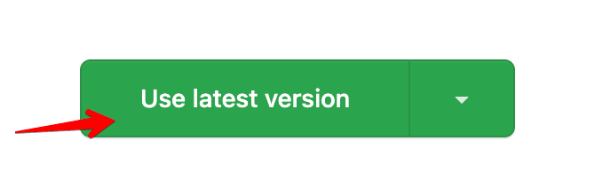

# Branches Cleaner Github Action <a href="https://devhunt.org/tool/branches-cleaner" alt="upvote in devhunt">Upvote us in Devhunt_</a>

<p align="center">
    
</p>

This GitHub Action automatically cleans up branches in a repository, deleting closed branches without merges, merged branches, and inactive branches after a specified period in days. You can specify the base branches or protected branches that should not be deleted.

<a href="https://www.buymeacoffee.com/mmoreno" target="_blank"></a>

## Inputs
### `base_branches`

***Required***. Comma-separated string of the base branches that you want to keep. For example: `main,develop`.

### `github_token`
***Required***. Token to authenticate with the GitHub API.

### `days_old_threshold`
***Optional***. Number of days of inactivity to remove inactive branches. Default is `7`.

## Usage
This GitHub Action can be triggered by different events offered by GitHub, depending on the needs of each team or individual. In the following example, a schedule trigger is used to run the action every day at midnight:

```` yaml
name: Branches Cleaner

on:
  schedule:
    - cron: "0 0 * * *"

jobs:
  cleanup-branches:
    runs-on: ubuntu-latest
    steps:
      - name: Checkout code
        uses: actions/checkout@v2
      - name: GitHub Branch Cleaner
        uses: mmorenoregalado/action-branches-cleaner@v2.0.1
        with:
          base_branches: develop,master
          token: ${{ secrets.GITHUB_TOKEN }}
          days_old_threshold: 7

````
Refer to the [official GitHub documentation](https://docs.github.com/en/actions/using-workflows/events-that-trigger-workflows) for more information on the different events that can be used to 
trigger GitHub Actions.

## Usage the latest version
To use the latest version:
1. Click on the following link http://bit.ly/3zgLxHf. This will redirect you to the official GitHub Action Page
2. Then click on `Use latest version`:

   

   
3. Finally replace the text in the GitHub Action YAML file in your .git/workflows/ folder.

   


With that you will have the latest version of Branches Cleaner installed.

## Contributing
This action is open to contributions. If you find any issues or bugs, feel free to open an issue or pull request.

## License
This project is licensed under the MIT License. See the [LICENSE](LICENSE) file for details.
