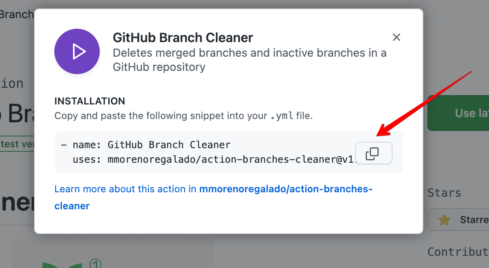

# Branches Cleaner Github Action

<p align="center">
    
</p>

This Github Action automatically deletes merged or unmerged branches in a repository. You can specify the base branches or protected branches that should not be deleted.

<a href="https://www.buymeacoffee.com/mmoreno" target="_blank"></a>

## Inputs
### `base_branches`

***Required***. Comma-separated string of the base branches that you want to keep. For example: `main,develop`.

### `github_token`
***Required***. Token to authenticate with the GitHub API.

## Usage
To use the Branches Cleaner Github Action, add the following code to your Github Actions workflow:

```` yaml
name: Branches Cleaner

on:
  schedule:
    - cron: "0 0 * * *"

jobs:
  cleanup-branches:
    runs-on: ubuntu-latest
    steps:
      - name: Checkout code
        uses: actions/checkout@v2
      - name: GitHub Branch Cleaner
        uses: mmorenoregalado/action-branches-cleaner@v1.1.2
        with:
          base_branches: develop,master
          github_token: ${{ secrets.GITHUB_TOKEN }}

````
This example uses a schedule trigger to run the action every day at midnight. The base_branches input takes a comma-separated list of base branches or protected branches that should

## Usage the latest version
To use the latest version:
1. Click on the following link http://bit.ly/3zgLxHf. This will redirect you to the official GitHub Action Page
2. Then click on `Use latest version`:

   

   
3. Finally replace the text in the GitHub Action YAML file in your .git/workflows/ folder.

   


With that you will have the latest version of Branches Cleaner installed.

## Contributing
This action is open to contributions. If you find any issues or bugs, feel free to open an issue or pull request.

## License
This project is licensed under the MIT License. See the [LICENSE](LICENSE) file for details.
